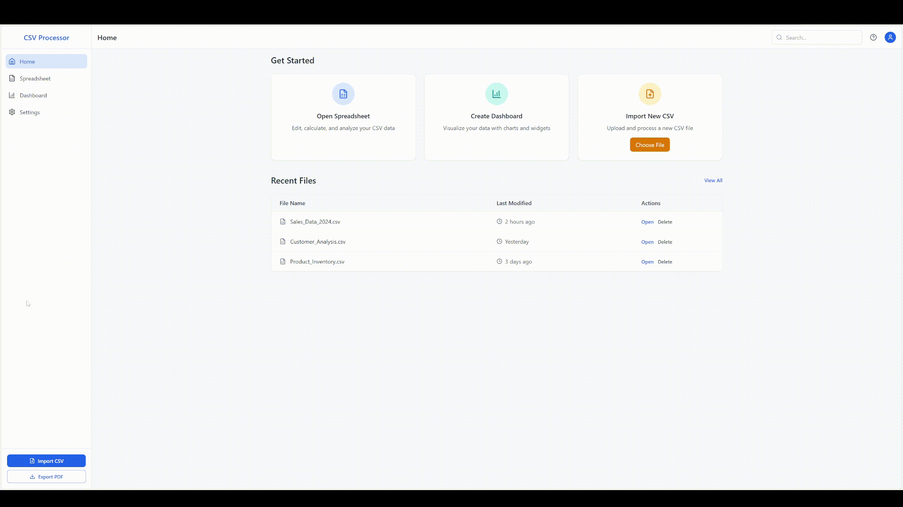

# CSV Data Processor

Современный веб-инструмент для обработки, анализа и визуализации CSV данных.



## Возможности

- **Импорт и экспорт CSV файлов** — Легко загружайте, обрабатывайте и экспортируйте данные в CSV формате
- **Электронная таблица** — Редактируйте данные в удобном табличном интерфейсе
- **Панель визуализации** — Создавайте интерактивные дашборды с диаграммами и виджетами
- **Аналитика данных** — Исследуйте свои данные с помощью мощных аналитических инструментов

## Технологии

### Фронтенд
- React + TypeScript
- Vite
- React Router
- Recharts для визуализации данных
- PapaParse для обработки CSV
- Tailwind CSS
- Zustand для управления состоянием
- React Grid Layout для настраиваемых дашбордов

### Бэкенд
- FastAPI (Python)
- SQLAlchemy ORM
- PostgreSQL
- JWT аутентификация
- Docker для контейнеризации

## Документация

- [README.md](README.md) - Основная документация проекта
- [README.python.md](README.python.md) - Подробная информация о Python бэкенде
- [README.docker.md](README.docker.md) - Дополнительная информация о Docker-настройке
- [DEVELOPMENT.md](DEVELOPMENT.md) - Журнал разработки с описанием процесса, решенных проблем и технических деталей реализации

## Начало работы

### Запуск полного стека (Python бэкенд)

Для запуска приложения с Python бэкендом и PostgreSQL:

```bash
# Клонировать репозиторий
git clone https://github.com/kirill778/naviserv.git
cd naviserv

# Запустить приложение с помощью Docker Compose
docker-compose -f docker-compose.python.yml up -d
```

После запуска:
- Фронтенд: http://localhost:5173
- API: http://localhost:3001
- pgAdmin (для управления БД): http://localhost:5050

### Установка для фронтенд-разработки

```bash
# Клонировать репозиторий
git clone https://github.com/kirill778/naviserv.git
cd naviserv

# Установить зависимости
npm install
```

### Запуск в режиме разработки

```bash
npm run dev
```

Приложение будет доступно по адресу [http://localhost:5173](http://localhost:5173)

### Сборка для продакшена

```bash
npm run build
```

## Запуск с использованием Docker

Проект поддерживает запуск в Docker-контейнерах, что гарантирует одинаковое окружение на любой системе.

### Запуск в режиме разработки (с горячей перезагрузкой)

```bash
docker-compose up app-dev
```

Приложение будет доступно по адресу [http://localhost:5173](http://localhost:5173)

### Запуск в продакшн режиме

```bash
docker-compose up app-prod
```

Приложение будет доступно по адресу [http://localhost](http://localhost)

### Остановка контейнеров

```bash
docker-compose down
```

## Использование

1. **Импорт данных**: Загрузите CSV файл через кнопку "Import CSV" на главной странице или странице электронной таблицы
2. **Редактирование данных**: Используйте электронную таблицу для просмотра и изменения данных
3. **Создание дашборда**: Переключитесь на страницу дашборда для создания визуализаций
4. **Экспорт результатов**: Экспортируйте данные в CSV формат или дашборд в PDF

## Учетные данные по умолчанию

После первого запуска Python бэкенда создается администратор со следующими данными:
- Пользователь: `admin`
- Пароль: `1234`

## Структура проекта

```
src/              # Фронтенд код
├── components/   # Переиспользуемые компоненты
├── layouts/      # Общие макеты страниц
├── pages/        # Основные страницы приложения
├── stores/       # Глобальное состояние (Zustand)
├── utils/        # Утилиты, включая обработку CSV
└── App.tsx       # Основной компонент приложения

server/           # Python бэкенд
├── auth/         # Аутентификация, JWT, хеширование паролей
├── config/       # Настройки приложения
├── models/       # Модели данных для SQLAlchemy
├── routes/       # API эндпоинты
└── database.py   # Настройка подключения к базе данных

# Документация проекта
README.md         # Основная документация
README.python.md  # Документация Python бэкенда
README.docker.md  # Документация Docker
DEVELOPMENT.md    # Журнал разработки
```

## Разработка

Процесс разработки проекта, включая этапы, технические детали и решения возникших проблем, документирован в файле [DEVELOPMENT.md](DEVELOPMENT.md). Этот журнал регулярно обновляется с описанием новых изменений и улучшений в проекте.

## Лицензия

MIT

## Контакты

- Веб-сайт: [yourwebsite.com](https://yourwebsite.com)
- GitHub: [@yourusername](https://github.com/yourusername)
- Email: your.email@example.com 